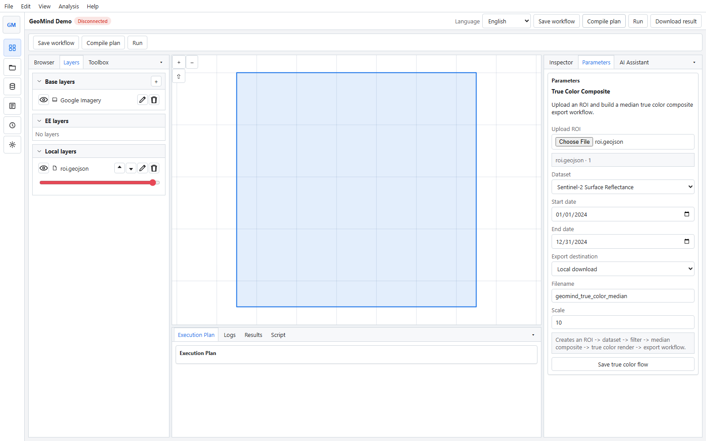
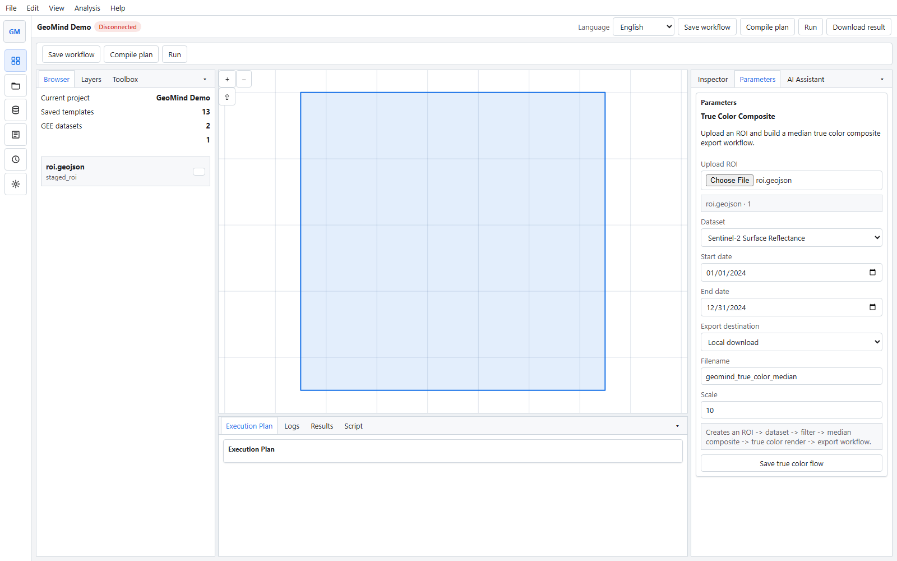
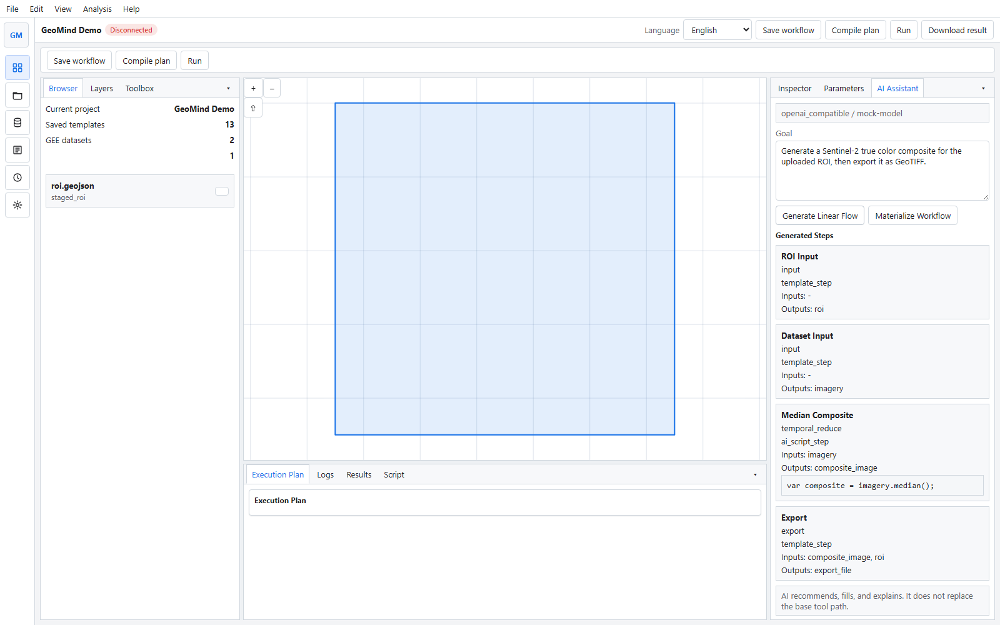

# GeoMind

[English](./README.en.md)

GeoMind 是一个面向 Earth Engine 的 AI 驱动桌面客户端。把 GEE 的资产、脚本、任务和地图工作区整合到一个本地应用里，让用户既可以用模板化工具完成常见遥感任务，也可以逐步过渡到 AI 辅助脚本生成与执行。
受类似Dify的AI工作流的启发，结合传统GIS桌面工具风格，基于Python和React开发，目前处于试验阶段
**！！！当前仓库处于目前处于试验阶段，重点是验证桌面工作区、GEE 连接、ROI/图层交互、AI 草案生成和运行链路，而不是提供稳定的生产版本。**


## 核心能力

- `桌面工作区`：Win10 风格的多面板布局，围绕地图、图层、参数、AI 与日志组织界面。
- `Earth Engine 连接`：支持浏览器登录脚手架与服务账户模式，便于后续接入真实运行链。
- `Tool / Template`：当前以模板脚本和参数化流程为主，适合快速验证遥感处理闭环。
- `AI Accelerator`：可配置 API key，生成结构化线性流程草案与脚本单元。
- `本地资源与图层`：支持 ROI 上传、图层树管理、运行结果回写到地图和历史记录。

## 当前状态

GeoMind 当前更适合被理解为一个 `AI-driven Earth Engine desktop demo`：

- 已具备：桌面 UI、项目/运行页面、基础 GEE 认证、ROI 上传、模板工具、AI 草案生成能力。
- 正在收敛：资产管理、脚本优先工作流、真实 GEE 任务执行、结果恢复与更强的任务中心。
- 尚未完成：完整 OAuth 闭环、成熟的资产入库流程、正式打包发布与生产级稳定性。

## 界面预览

### 工作区



### 资源与参数联动



### AI 助手



## 技术架构

GeoMind 当前采用前后端分离的本地桌面架构：

- `desktop/`：Electron + React + TypeScript，提供桌面壳、地图工作区、多页面 UI 与本地交互。
- `backend/`：FastAPI + Python，负责认证、工作流编排、AI 配置、运行记录、SQLite 存储与本地处理能力。
- `shared workflow core`：以 `WorkflowSpec -> ExecutionPlan -> Run -> Artifact` 为当前主链，并逐步向 `Assets / Scripts / Tasks / AI` 模型演进。

更多设计文档见 [docs/README.md](./docs/README.md)。

## 快速开始

### 环境要求

- Windows
- Node.js 24+
- Python 3.12+

### 安装依赖

前端：

```powershell
npm install
```

后端：

```powershell
.\backend\scripts\bootstrap.ps1
```

### 启动开发环境

启动后端：

```powershell
.\backend\scripts\dev.ps1
```

启动前端渲染进程：

```powershell
npm run dev:renderer -- --host 127.0.0.1
```

启动 Electron 桌面壳：

```powershell
npm run dev:electron
```

也可以直接同时启动前端与 Electron：

```powershell
npm run dev
```

## 开发命令

构建前端：

```powershell
npm run build
```

运行后端测试：

```powershell
.\backend\scripts\test.ps1
```

运行 UI 冒烟测试：

```powershell
npm run test:ui
```

## 项目结构

```text
backend/   FastAPI backend, workflow core, providers, storage
desktop/   Electron + React desktop client
docs/      架构、工作流、开发规范与路线图
tests/     Playwright UI smoke tests
```

## 路线图

- `V0.1`：桌面工作区、工作流骨架、认证脚手架、AI 草案、基础运行链
- `V0.2`：更强的项目管理、模板库、真实 GEE 执行、脚本编辑与资源管理
- `V0.3+`：MCP/CLI、更多本地处理、脚本优先能力、混合执行策略

详细版本规划见 [docs/roadmap.md](./docs/roadmap.md)。

## 文档

- [Docs Overview](./docs/README.md)
- [Architecture](./docs/architecture.md)
- [Workflow Schema](./docs/workflow-schema.md)
- [Backend API](./docs/backend-api.md)
- [Development Guide](./docs/development-guide.md)

## 许可证

本项目使用 [MIT License](./LICENSE)。
